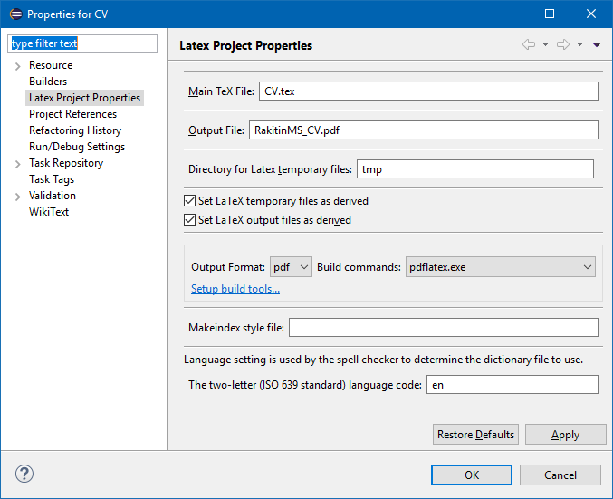
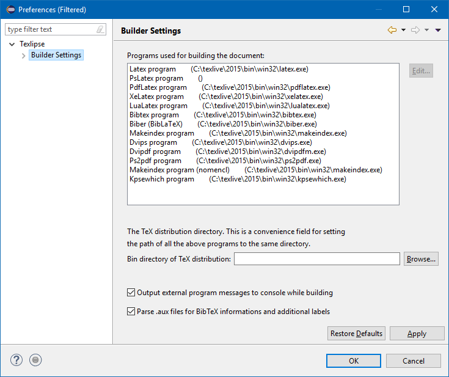

# CV
Here is my [CV](RakitinMS_CV.pdf). See more at http://staff.ps.bnl.gov/staff.aspx?id=92991 and at https://mrakitin.xyz.

# Compile instructions:
- Install [TeX Live](https://www.tug.org/texlive/acquire-netinstall.html). On Windows all the required packages are installed with TeX Live. On Linux install LaTeX and additional packages as follows:
  ```shell
  $ sudo apt install texlive
  $ sudo apt install ghostscript
  $ sudo apt install moderncv
  $ sudo apt install texlive-latex-extra
  ```
- Install [Eclipse IDE](https://www.eclipse.org/downloads/)
- Install [TeXlipse](http://texlipse.sourceforge.net/manual/installation.html)
- Configure a LaTeX project:

- Click `Setup build tools...` and confugure the builder:


You are ready to go - when you change anything in the CV.tex file, the TeXlipse will recompile the `.pdf` file automatically.

# Bibliography
I prefer and recommend to use [JabRef](http://www.jabref.org/), a cross-platform bibliography management tool, which works great with the bibliography in MS Word as well.
